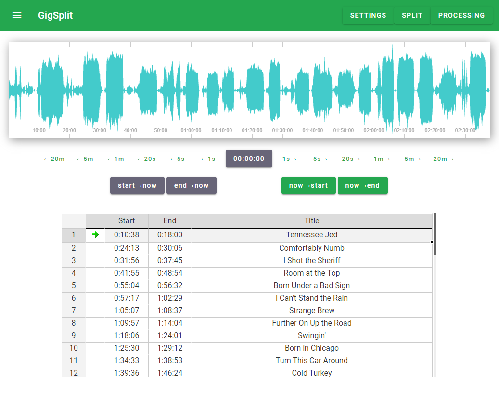

## GigSplit: Splits long mp3 and multitrack recordings

This is a web app for splitting a long mp3 recording into separate songs. It can also split a folder full
of wavs files, one per channel, and produce a folder full of multitrack songs ready for mixing.

Written using Svelte, peaks.js, and jExcel. Works under Linux, but could probably be made to work elsewhere
if the command-line audio tools can be made available.

### Requirements

Requires node and npm to be installed.

The following audio tools must be available on your server (in your path):

1. audiowaveform https://github.com/bbc/audiowaveform
2. sox `sudo apt install sox`
3. cutmp3 `sudo apt install cutmp3`
4. id3tool `sudo apt install id3tool`
4. flac `sudo apt install flac`

### Installation

1. Clone this repository and `cd` there
2. `npm install`
3. `./copyCss.sh`
4. Other patches that might be necessary to eliminate warnings are listed in `./patches.md`
5. `npm run dev` or `npm run build` and `npm run start`

### Usage

GigSplit requires a data directory containing an `mp3` file and, optionally, a directory full of
individual channel recordings in `wav` format. Both are identified by the date of the recording
in the format YYYYMMDD. For example, for a recording on 12/05/2019, the data directory should
contain `20191205.mp3` and a directory of wavs called `20191205.wavs/` (there may be other files
in the directory, they will be ignored).

The data directory should be symlinked (or copied, if you want) into `./static` with the name `data`.
I usually have a separate directory for each recording, but because the files are identified by the
date in the file names, you could process multiple recordings in the same directory. The mp3 files
for the individual songs will be written to `./static/data/<band name in lowercase>-<date>` and
the multitrack splits for each song will be written to `./static/data/multitrack/<date>-<song title>/`.
The files in the multitrack directory will have the same names as the original wav files and will
be compressed to `flac` format.

Go to `localhost:3000` in your browser. On the `Settings` page, enter the band name, album name,
date, and genre. On the `Split` page, it should find your mp3 file and prompt you to create the
corresponding `.dat` file (containing the peaks for the waveform display). If not, go back to
the `Settings` page and fix the date, and verify that `./static/data` contains your mp3 file and
wavs directory.

Once the waveform is shown on the `Settings` page, you can begin splitting the recording. The
middle button below the waveform shows the current position and starts/stops playback. The buttons
to the right and left advance and retreat. Once you've selected a line in the table, the buttons
above the table allow you to copy the current time (`now`) to the start or end column, or copy
the values in the table to `now`. 

Once the table is full go to the `Processing` page, where you can create the directories, split
the mp3 file, and split the wavs. After each mp3 song is created GigSplit will tag the file with
the info you provided on the `Settings` page. After splitting the wav files GigSplit will compress
them, losslessly, to flac and remove the wav files. Your original mp3 and wav files are never
modified.

### Typical Workflow

1. Record your session in multitrack. The free version of Tracktion works fine for this, but you can
use any DAW software that records to wav. Don't worry
about pausing the recording, since you'll be cutting it later. I only pause when we take a break.
Use a Tracktion preset that has all of your channels named with the instrument and performer (this will
end up in the wav filenames). Save your Tracktion session.
2. If you never paused while recording, you'll have one wav file per channel. But if you did, you can't
just concatenate the files, you need to do this in Tracktion. The start times for each channel will
vary slightly, and this info is in your Tracktion session. Render the session, selecting the option
to generate one file per channel. I also enable normalization here, and I don't add any effects.
3. Move the wav files to your `<date>.wavs` directory. If you had to merge them in your DAW, then
they're probably all stereo now. You might want to make the channels that were originally mono mono
again, you can do this with `sox <input wav> <output wav> remix 1,2`. You should also remove any
spaces in the filenames.
4. Create a new Tracktion project and import the files from your `<date>.wav` directory, one per 
channel. Create a rough mix, keeping in mind that you'll do the real mixes with the split files.
For now, you just want to make something listenable. I add effects to a few tracks and look for
the loudest sections for each channel to set reasonable levels. Render to a stereo wav file
and convert that to mp3 with an external program (for example, `lame -b 256 <wav file>`). Move
the mp3 file to `<date>.mp3` in your data directory.
5. Symlink your data directory to `./static/data` in your GigSplit directory, start up GigSplit
and split the session.
6. Now that I have the starts and ends of all the songs, I reopen my Tracktion project and tweak
the mix. I do this because, for many of the songs, no one will ever get around to mixing them.
Mix down to stereo mp3, replace your `<date>.mp3` file, and re-split in GigSplit.
7. I also normalize the gain of all of the mp3 songs using `mp3gain -r -c *.mp3` in the output
directory.
8. Burn copies of the multitrack wav files, give them to your bandmates, and tell them to mix them.
You've done enough work already!

